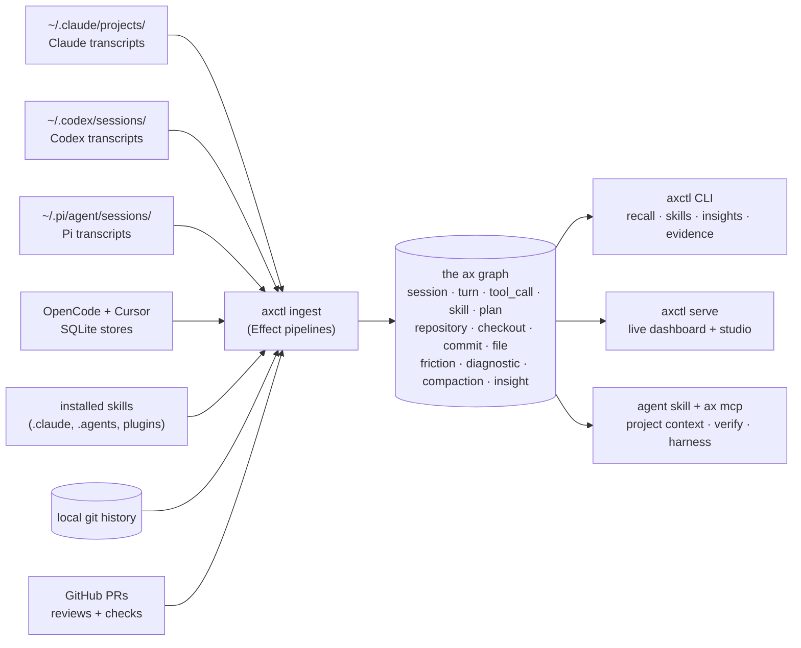
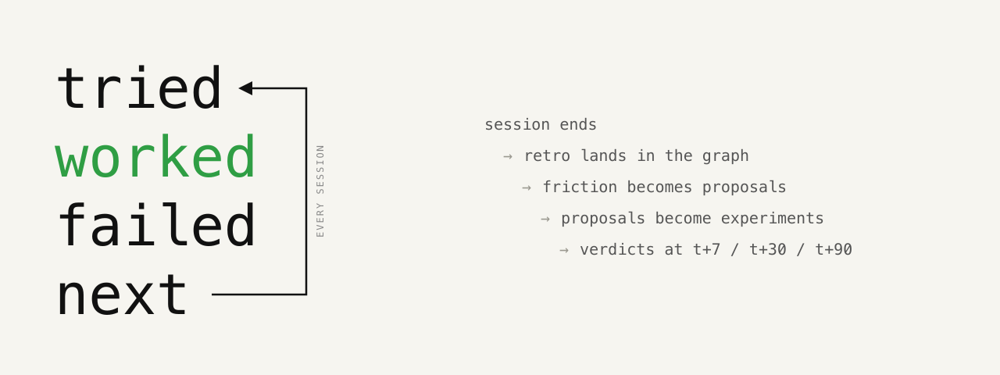

# ax

###### the retro loop for AI coding agents

**Make your agent learn.**
Turn every agent session into a better next run.

---

Every sub-agent you spawn finishes its work and disappears. Whatever it
figured out - which command failed three times before the right one, which
file actually mattered, which approach to skip - dies with it. The next
sub-agent rediscovers it from scratch. Your own next session does too.

`ax` watches every session your harness runs, spots the mistakes it
repeats, and turns them into small, repo-specific fixes you review and
apply - one at a time.

Under the hood, it's the loop that closes before the session ends. A Stop hook fires
at session-end (main or sub-agent), asks the agent for a structured retro
(*tried · worked · failed · next*), and indexes the result as a typed
experiment in a local graph. Friction patterns become proposals you
triage. Accepted proposals become experiments with t+7 / t+30 / t+90
verdicts. The next session reads what worked.

> *What did this sub-agent learn? Which experiments are still open?
> Which skills earned their keep? What did that branch cost in tokens?*
> `ax` answers these by reading what already happened.


## 60 seconds in

```bash
curl -fsSL ax.necmttn.com/install | sh
PATH="$HOME/.local/bin:$PATH" ax setup   # agent skills + first ingest + doctor
```

Or skip the terminal entirely - paste this into Claude Code / Codex and your
agent installs ax, ingests your history, labels your skills, and tells you
which ones to actually use:

<details>
<summary><strong>the setup prompt - give this to your agent</strong></summary>

```text
Set up ax for me, end to end. ax is a local agent-experience graph over my Claude Code + Codex history - it runs locally and I review every change.

1. INSTALL - run `curl -fsSL ax.necmttn.com/install | sh` to install the ax CLI. Reference: https://ax.necmttn.com/docs

2. INGEST MY HISTORY - first run `ax ingest --dry-run` and tell me, in plain words, how long a full backfill will take. Then start the ingest in the BACKGROUND so we can keep working: run `ax ingest` as a background job with AX_PROGRESS=plain, and watch its output for progress and completion. Tell me I can watch it fill live in the dashboard - run `ax serve` and open http://127.0.0.1:8520. When the ingest finishes, summarize what landed: total sessions, turns, and the top skills/tools I actually use. Then continue with the steps below.

3. VERIFY - run `ax doctor`. If anything isn't ok, diagnose and fix it, then re-run until it is.

4. LABEL what ax can't classify - run `ax skills classify`. It writes one `.ax/tasks/classify-<skill>.md` brief per skill I use but ax can't role-tag. For each brief: read the skill, decide its role(s), and fill the YAML at the bottom (`primary_role:` is required; `secondary_roles`, `confidence`, `rationale` are optional). Run `ax roles` to see labels already in use. Then run `ax skills lint` to apply them. If it says "no unclassified skills", that's fine.

5. SHOW me the result - run `ax skills weighted` and `ax skills config`. Tell me which skills you labeled and why, and flag anything ax marked orphan or out-of-scope.

6. GIVE ME A NEXT STEP - recommend 1-2 under-used skills you'd reach for based on what you saw, then end with a concrete CTA: the exact command or prompt I should run next, and what outcome it will produce.
```

</details>

Then ask the graph things you couldn't ask before:

```bash
ax recall "auth bug"          # full-text recall across every past session
ax skills taste               # which skills earned their keep
ax costs for --branch main    # what a branch cost in tokens
ax sessions metrics           # graph-derived session health
ax share <session-id>         # publish a session anyone can read
ax serve                      # live dashboard at http://127.0.0.1:8520
```

Requires Bun ≥ 1.3 and SurrealDB ≥ 3.0. macOS-first; Linux works for ingest
and CLI (no launchd reactivity). Dev install, schema, queries, benchmarks:
[`docs/development.md`](docs/development.md).

## Every harness, one graph

Five harnesses - Claude Code, Codex, Pi, OpenCode, Cursor - plus installed
skills, local git history, and GitHub PRs with their reviews and checks, all
ingested into one local SurrealDB graph: sessions, turns, tool calls, plans,
skills, commits, files, friction, compaction, derived signals. Ingest is a
staged Effect pipeline; unchanged sources are skipped, so re-ingest takes
seconds. A launchd watcher keeps it current as you work. Everything runs on
`127.0.0.1` - no network round-trip, no third party.

Signals are normalized across harnesses: "context ran out and got summarized"
is one queryable compaction event whether it came from Claude Code or Codex.
The pipeline in one line: **every event → typed graph → ranked interventions**.



## Recall every session you ever ran

Full-text BM25 search across turns, commits, and skills - milliseconds, local:

```text
$ ax recall "auth middleware"
4 matches

2026-05-23T15:19  codex      user       acme-app   alright lets commit auth related work for now
2026-05-23T14:51  codex      assistant  acme-app   Added the HealthOS just setup. You can now run from repo root: just health dev …
2026-05-23T14:41  codex      assistant  acme-app   Findings: apple-auth.service.ts accepts extra Apple audiences from ambient env …
2026-05-19T11:08  claude     user       ax         the auth middleware retry loop - we still see exit-code 1 from bun check after …
```

## Know which skills earned their keep

Composite score over the last 30 days, across every installed skill:

```text
$ ax skills taste --limit=8
skill                              scope        score    7d     30d    total
codex:exec_command                 codex-tool  40902.5  1,124  30,500  40,389
codex:write_stdin                  codex-tool   6,957     166   4,932   6,451
codex:rescue                       command        781       0     389     605
codex:update_plan                  codex-tool   766.5      14     338     391
simplify                           user         718.5       5      89     101
codex:wait_agent                   codex-tool     713       3     497     507
codex:spawn_agent                  codex-tool     647       2     439     442
superpowers:systematic-debugging   plugin         26.5      0       6       6

(8 / 288 skills shown)
```

And which tools fail most often, so you know what to skill-up around:

```text
$ ax insights tools --limit=5
name           failure_count   exit_code   last_seen
write_stdin    647             1           2026-05-23T14:34
Edit           483             -           2026-05-23T05:14
Skill          475             -           2026-05-05T13:34
exec_command   421             1           2026-05-22T18:50
Bash           318             1           2026-05-21T22:12
```

31 read-only graph views in `ax insights`; full list in
[`docs/insights-cli-reference.md`](docs/insights-cli-reference.md).

## Put a price on everything

Token cost resolved through model pricing rows - prompt, output, cache
read/write, estimated USD - queryable by session, text, commit, or branch:

```bash
ax costs summary --since=7              # by provider/model, last 7 days
ax costs for --query "live-traces"      # cost of sessions matching turn text
ax costs for --commit 464c80b           # cost of the sessions behind a commit
ax costs for --branch feat/share        # cost of a whole feature branch
```

So "what did that refactor cost" has an answer with a dollar sign on it.

## Share a session like a gist

```bash
ax share <session-id>
# → https://ax.necmttn.com/s/<owner>/<gist-id>
```

Exports the full session - subagent transcripts, harness hook fires, per-turn
pricing - sanitizes it, publishes it as a GitHub Gist, and serves it through a
hosted viewer: unified tool-call cards, session timeline, cost rail, and a
per-session poster image for the link unfurl. The data stays in your gist,
under your account; the viewer just renders it.

## Watch your agents work

`ax serve` runs the dashboard + studio over the same graph:

- **Transcript view** - tool call and result as one card, skill and image
  turns folded, subagent spawns with their metrics.
- **Session timeline** - highlights, segments, and events derived from the
  graph, no LLM in the loop.
- **Session canvas** - a semantic-zoom lineage graph of sessions and the
  subagents they spawned: swimlanes, time-axis zoom up to 2000x, hover detail
  in ~30ms.
- **Live ingest** - trigger a run from the dashboard and watch stages stream;
  refresh mid-run and it resumes where it was.
- **Metrics** - `ax sessions metrics` and `ax signals` surface graph-derived
  session health (fragility cascades, plan churn, tool retries), and
  `ax sessions compare` puts two runs side by side.
- **Harness doctor** - grades how well your setup is actually working;
  every fix you apply moves the score.

## Close the loop: grounded agent files



ax recommends changes to your `AGENTS.md` / `CLAUDE.md` / skills - grounded in
evidence from your own sessions - and tracks which lines came from it:

```text
session ends           ax retro emit          # structured note: tried · worked · failed · next
proposals derive       ax improve recommend   # ranked by confidence × recency × frequency
pick one               ax improve accept <id> # writes .ax/tasks/<id>.md - hand to your agent
reconcile              ax improve lint        # marker ↔ DB ↔ task files
verdict at +3/+10/+30  ax improve verdict --set=adopted|ignored|regressed|partial
sessions               # session-count windows, not calendar days
```

Every proposal carries its evidence trail (`ax improve show <id>`). Verdicts
land on session-count windows, so a skill that stopped firing gets caught, not
forgotten.

## Your agent can query all of this mid-session

Two integration paths, same graph:

```bash
npx skills add Necmttn/ax           # agent skills: setup, retro, extract-workflow, …
claude mcp add ax -- ax mcp         # MCP server: read-only graph queries as tools
```

Recommended agent loop: `ax project context --json` before work (stack, recent
friction, verification commands), do the work, `ax project verify --json`
before reporting done. For Codex, add `ax mcp` to `~/.codex/config.toml`. Tool
list and details: [`docs/cli.md`](docs/cli.md#mcp-server-tools).

## Why an experience layer

LLM agents are good at tasks. They're bad at remembering what happened.
Memory tooling today is either a giant rolling context window (expensive,
slow, lossy) or vague vector retrieval (no structure, no grounding in real
events).

`ax` takes a different shape: a **typed graph of evidence** built from the
agent's own logs. Three things fall out of that, and they're the three things
"agent experience" actually means in practice:

1. **Skill triage** - which of your installed skills get used, which never
   fire, which correlate with stuck sessions.
2. **Pre-flight grounding** - `ax project context` hands the next agent
   stack info, recent friction, and verification commands.
3. **Retro signal** - query the graph after a hard session: tool retries,
   plan churn, file edit pairings. Feed it back into the next run.

`AX` (agent experience) is what the agent perceives across sessions, reflects
on at the end of each, and turns into the next experiment. It is to AI coding
agents what retros and post-mortems are to engineering teams - a structured
reflection step that compounds. A longer take:
[`docs/manifesto.md`](docs/manifesto.md).

## Docs

- [`docs/cli.md`](docs/cli.md) - full CLI reference, costs, improve, MCP tools
- [`docs/manifesto.md`](docs/manifesto.md) - the missing layer in the agent stack
- [`docs/language.md`](docs/language.md) - coined vocabulary, the AX glossary
- [`docs/brand.md`](docs/brand.md) - design system + voice rules
- [`docs/development.md`](docs/development.md) - local setup, schema, queries, benchmarks
- [`CONTRIBUTING.md`](CONTRIBUTING.md) - PR conventions, ground rules
- [`CONTEXT.md`](CONTEXT.md) - domain glossary (Repository vs. Checkout vs. …)
- [`docs/adr/`](docs/adr/) - architecture decisions

## Community

Questions, feedback, or want to shape where ax goes next? Join the Discord:
[discord.gg/E4R88Cvr5R](https://discord.gg/E4R88Cvr5R)

## License

If it shapes your agent, you should be able to fork it.

[AGPL-3.0-only](LICENSE) © 2025 Necmettin Karakaya. A
[commercial license](docs/COMMERCIAL-LICENSE.md) is available for use that the
AGPL doesn't permit - reach out via the Discord above.
