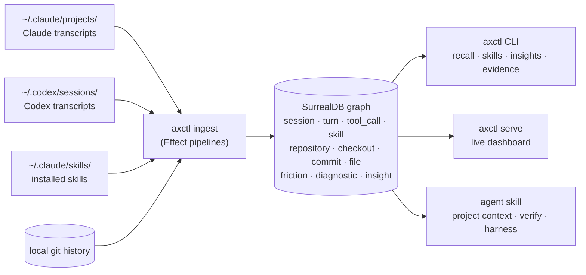

# ax

###### the agent experience layer

**Make your agent remember.**
Ingests. Indexes. Surfaces. Local. Typed. Yours.

---

Every session, your AI coding agent starts from zero. It re-reads the same
files, re-discovers the same patterns, re-invokes the same broken tools, and
re-learns the same lessons you taught it last week.

`ax` is the layer underneath. It ingests transcripts from Claude Code and
Codex, plus your installed skills and local git history, into a local
SurrealDB graph - then surfaces what's signal vs. noise on demand, for you
*and* for the next agent session.

> *Which skills did I actually use this month? Which tool calls keep failing?
> Which files change together? What did I tell the agent that it forgot?*
> `ax` answers these by reading what already happened.


## What is AX

`AX` is what the agent perceives across sessions, remembers, and acts
on. It is to AI coding agents what DX is to humans: the surface that
turns capability into compounding skill. `ax` is the reference
implementation - local, typed, MIT-licensed.

A longer take: [`docs/manifesto.md`](docs/manifesto.md). Vocabulary:
[`docs/language.md`](docs/language.md).

## How it fits together



Everything runs on `127.0.0.1`. The agent and the CLI both read the same
graph; the dashboard is a thin React view over the same queries.

## A taste of the output

Which skills earned their keep, by composite score over the last 30 days:

```text
$ axctl skills taste --limit=8
skill                              scope        score    7d     30d    total
codex:exec_command                 codex-tool  40902.5  1,124  30,500  40,389
codex:write_stdin                  codex-tool   6,957     166   4,932   6,451
codex:rescue                       command        781       0     389     605
codex:update_plan                  codex-tool   766.5      14     338     391
simplify                           user         718.5       5      89     101
codex:wait_agent                   codex-tool     713       3     497     507
codex:spawn_agent                  codex-tool     647       2     439     442
superpowers:systematic-debugging   plugin        26.5       0       6       6

(8 / 288 skills shown)
```

Recall past work across every session, in milliseconds:

```text
$ axctl recall "auth middleware"
4 matches

2026-05-23T15:19  codex      user       acme-app   alright lets commit auth related work for now
2026-05-23T14:51  codex      assistant  acme-app   Added the HealthOS just setup. You can now run from repo root: just health dev …
2026-05-23T14:41  codex      assistant  acme-app   Findings: apple-auth.service.ts accepts extra Apple audiences from ambient env …
2026-05-19T11:08  claude     user       ax         the auth middleware retry loop - we still see exit-code 1 from bun check after …
```

Which tools fail most often, so you know what to skill-up around:

```text
$ axctl insights tools --limit=5
name           failure_count   exit_code   last_seen
write_stdin    647             1           2026-05-23T14:34
Edit           483             -           2026-05-23T05:14
Skill          475             -           2026-05-05T13:34
exec_command   421             1           2026-05-22T18:50
Bash           318             1           2026-05-21T22:12
```

## Why an experience layer

LLM agents are good at tasks. They're bad at remembering what happened.
Memory tooling today is either a giant rolling context window (expensive,
slow, lossy) or vague vector retrieval (no structure, no grounding in real
events).

`ax` takes a different shape: a **typed graph of evidence** built from the
agent's own logs. Sessions, turns, tool calls, plans, skills, commits, files,
friction, and derived signals - all queryable in SurrealDB, all local, no
network round-trip, no third party.

Three things fall out of that, and they're the three things "agent
experience" actually means in practice:

1. **Skill triage** - which of your installed skills get used, which never
   fire, which correlate with stuck sessions.
2. **Pre-flight grounding** - `axctl project context` hands the next agent
   stack info, recent friction, and verification commands.
3. **Retro signal** - query the graph after a hard session: tool retries,
   plan churn, file edit pairings. Feed it back into the next run.

## Install

```bash
curl -fsSL https://raw.githubusercontent.com/Necmttn/ax/main/install.sh | bash
PATH="$HOME/.local/bin:$PATH" axctl ingest --since=7
```

Requires Bun ≥ 1.3 and SurrealDB ≥ 3.0. macOS-first; Linux works for ingest
and CLI (no launchd reactivity).

For dev install, schema, queries, and benchmarks, see
[`docs/development.md`](docs/development.md).

## Quickstart

```bash
axctl ingest --since=7     # backfill last 7 days of transcripts + skills + git
axctl serve                # live dashboard at http://127.0.0.1:8520
axctl skills taste         # CLI view: which skills earned their keep
axctl recall "auth bug"    # full-text recall across past sessions
```

## Agent integration

`ax` ships two installable skills so a Claude Code / Codex agent can query
its own evidence graph mid-session:

```bash
npx skills add git@github.com:Necmttn/ax.git --skill axctl    -g -a claude-code -a codex -y
npx skills add git@github.com:Necmttn/ax.git --skill ax-retro -g -a claude-code -a codex -y
```

Recommended agent loop:

1. `axctl project context --json` before work - stack, recent friction,
   verification commands.
2. Do the work.
3. `axctl project verify --json` before reporting done - runs the checks
   the project actually expects.

## CLI shape

```text
axctl ingest [--since=N] [--reset]
axctl serve | report               # live dashboard / static HTML
axctl recall <query>               # full-text search across turns
axctl skills <search|taste|unused|pairs|recovery>
axctl insights <view>              # 16 read-only graph views
axctl project <context|verify|harness>
axctl evidence <guidance-next|session-summary|weekly>
axctl daemon <status|start|stop|restart>
axctl doctor | install | uninstall | update | version
```

Full reference: [`docs/insights-cli-reference.md`](docs/insights-cli-reference.md).

## Docs

- [`docs/manifesto.md`](docs/manifesto.md) - the missing layer in the agent stack
- [`docs/language.md`](docs/language.md) - coined vocabulary, the AX glossary
- [`docs/brand.md`](docs/brand.md) - design system + voice rules
- [`docs/development.md`](docs/development.md) - local setup, schema, queries, benchmarks
- [`CONTRIBUTING.md`](CONTRIBUTING.md) - PR conventions, ground rules
- [`CONTEXT.md`](CONTEXT.md) - domain glossary (Repository vs. Checkout vs. …)
- [`docs/adr/`](docs/adr/) - architecture decisions

## License

[MIT](LICENSE) © 2025 Necmettin Karakaya
