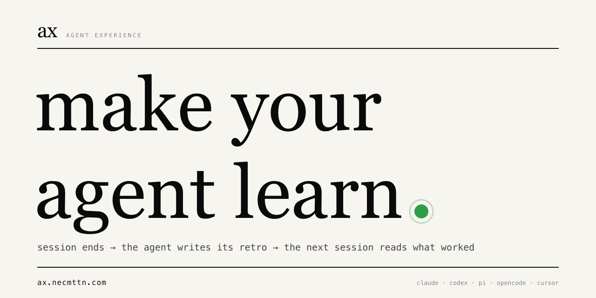
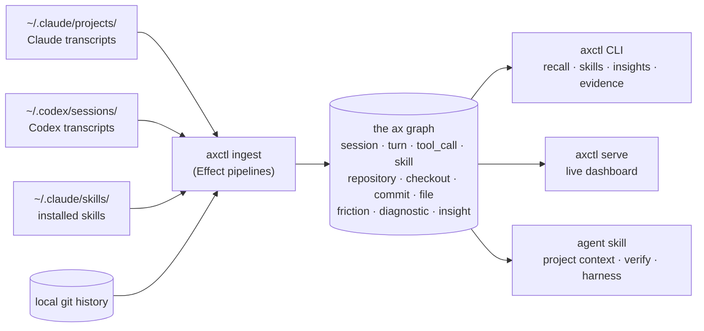

# ax

###### the retro loop for AI coding agents

**Make your agent learn.**
Reflects. Experiments. Improves. Across every session.

---

Every sub-agent you spawn finishes its work and disappears. Whatever it
figured out - which command failed three times before the right one, which
file actually mattered, which approach to skip - dies with it. The next
sub-agent rediscovers it from scratch. Your own next session does too.

`ax` is the loop that closes before the session ends. A Stop hook fires
at session-end (main or sub-agent), asks the agent for a structured retro
(*tried · worked · failed · next*), and indexes the result as a typed
experiment in a local graph. Friction patterns become proposals you
triage. Accepted proposals become experiments with t+7 / t+30 / t+90
verdicts. The next session reads what worked.

> *What did this sub-agent learn? Which experiments are still open?
> Which skills earned their keep? Which hooks blocked anything useful?*
> `ax` answers these by reading what already happened.



## What is AX

`AX` (agent experience) is what the agent perceives across sessions,
reflects on at the end of each, and turns into the next experiment. It
is to AI coding agents what retros and post-mortems are to engineering
teams - a structured reflection step that compounds.

`ax` (lowercase) is the reference implementation. Local typed graph,
Stop-hook-driven retros, agent-readable queries, React dashboard, MIT.
A longer take: [`docs/manifesto.md`](docs/manifesto.md). Vocabulary:
[`docs/language.md`](docs/language.md).

## How it fits together



Everything runs on `127.0.0.1`. The agent and the CLI both read the same
graph; the dashboard is a thin React view over the same queries.

## A taste of the output

Which skills earned their keep, by composite score over the last 30 days:

```text
$ axctl skills taste --limit=8
skill                              scope        score    7d     30d    total
codex:exec_command                 codex-tool  40902.5  1,124  30,500  40,389
codex:write_stdin                  codex-tool   6,957     166   4,932   6,451
codex:rescue                       command        781       0     389     605
codex:update_plan                  codex-tool   766.5      14     338     391
simplify                           user         718.5       5      89     101
codex:wait_agent                   codex-tool     713       3     497     507
codex:spawn_agent                  codex-tool     647       2     439     442
superpowers:systematic-debugging   plugin        26.5       0       6       6

(8 / 288 skills shown)
```

Recall past work across every session, in milliseconds:

```text
$ axctl recall "auth middleware"
4 matches

2026-05-23T15:19  codex      user       acme-app   alright lets commit auth related work for now
2026-05-23T14:51  codex      assistant  acme-app   Added the HealthOS just setup. You can now run from repo root: just health dev …
2026-05-23T14:41  codex      assistant  acme-app   Findings: apple-auth.service.ts accepts extra Apple audiences from ambient env …
2026-05-19T11:08  claude     user       ax         the auth middleware retry loop - we still see exit-code 1 from bun check after …
```

Which tools fail most often, so you know what to skill-up around:

```text
$ axctl insights tools --limit=5
name           failure_count   exit_code   last_seen
write_stdin    647             1           2026-05-23T14:34
Edit           483             -           2026-05-23T05:14
Skill          475             -           2026-05-05T13:34
exec_command   421             1           2026-05-22T18:50
Bash           318             1           2026-05-21T22:12
```

## Why an experience layer

LLM agents are good at tasks. They're bad at remembering what happened.
Memory tooling today is either a giant rolling context window (expensive,
slow, lossy) or vague vector retrieval (no structure, no grounding in real
events).

`ax` takes a different shape: a **typed graph of evidence** built from the
agent's own logs. Sessions, turns, tool calls, plans, skills, commits, files,
friction, and derived signals - all queryable, all local, no
network round-trip, no third party.

Three things fall out of that, and they're the three things "agent
experience" actually means in practice:

1. **Skill triage** - which of your installed skills get used, which never
   fire, which correlate with stuck sessions.
2. **Pre-flight grounding** - `axctl project context` hands the next agent
   stack info, recent friction, and verification commands.
3. **Retro signal** - query the graph after a hard session: tool retries,
   plan churn, file edit pairings. Feed it back into the next run.

## Install

```bash
curl -fsSL https://raw.githubusercontent.com/Necmttn/ax/main/install.sh | bash
PATH="$HOME/.local/bin:$PATH" axctl ingest --since=7
```

Skills are distributed via the [skills.sh](https://skills.sh) marketplace.
After the CLI is installed, drop the agent skills into your Claude Code
session with:

```bash
npx skills add Necmttn/ax           # installs ax:setup + ax:retro skills
```

Requires Bun ≥ 1.3 and SurrealDB ≥ 3.0. macOS-first; Linux works for ingest
and CLI (no launchd reactivity).

For dev install, schema, queries, and benchmarks, see
[`docs/development.md`](docs/development.md).

## Quickstart

```bash
axctl ingest --since=7     # backfill last 7 days of transcripts + skills + git
axctl serve                # live dashboard at http://127.0.0.1:8520
axctl skills taste         # CLI view: which skills earned their keep
axctl recall "auth bug"    # full-text recall across past sessions
```

## Agent integration

`ax` ships two installable skills so a Claude Code / Codex agent can query
its own evidence graph mid-session:

```bash
npx skills add git@github.com:Necmttn/ax.git --skill axctl    -g -a claude-code -a codex -y
npx skills add git@github.com:Necmttn/ax.git --skill retro -g -a claude-code -a codex -y
```

Recommended agent loop:

1. `axctl project context --json` before work - stack, recent friction,
   verification commands.
2. Do the work.
3. `axctl project verify --json` before reporting done - runs the checks
   the project actually expects.

## CLI shape

```text
axctl ingest [--since=N] [--reset]         # backfill the graph
axctl ingest here [--since=Nd]             # scope ingest to the git repo at $PWD
axctl derive-signals                        # re-run derive pass standalone
axctl derive-intents                        # re-run user-intent derive standalone
axctl serve                                 # live web dashboard (API for ax studio)
axctl report                                # one-shot static HTML
axctl tui                                   # interactive terminal dashboard

axctl recall <query> [--sources=turn,commit,skill] [--scope=here|all]
                                            # cross-session BM25 full-text search
axctl context [file] [<query>]              # file/agent-context grounding
axctl skills <search|taste|unused|pairs|recovery|classify|tag|lint|weighted|by-role|roles>
axctl insights <view>                       # 19 read-only graph views
axctl classifiers <list|eval|explain>       # classifier coverage and turn explanations
axctl costs <summary>                       # token/cost usage by provider/model quality
axctl sessions <here|around <date>|near <sha>|show <id>>
                                            # windowed session queries
axctl roles                                 # list role labels with skill counts
axctl project <context|verify|harness>
axctl evidence <guidance-next|session-summary|weekly>
axctl improve <list|show|accept|reject|verdict|checkpoint|reset>
axctl retro <emit|list|reflect|plan>        # the retro-loop CLI
axctl hook <fire>                           # hook helper invoked from settings.json
axctl hooks <summary|invocations|backtest>

axctl daemon <status|start|stop|restart>
axctl doctor                                # local-install health check
axctl install                               # wire launchd + hooks + DB
axctl uninstall                             # remove launchd + bin symlink
axctl update [--check]                      # pull latest release
axctl version [--check|--banner]
```

Full reference: [`docs/insights-cli-reference.md`](docs/insights-cli-reference.md).

### Grounded agent files

ax can recommend changes to your `AGENTS.md` / `CLAUDE.md` (and skill files)
and track which lines came from it.

End-to-end flow:

```text
session ends           axctl retro emit        # structured note: tried · worked · failed · next
proposals derive       axctl improve recommend # ranked by confidence × recency × frequency
pick one               axctl improve accept <id>
                       # default: writes .ax/tasks/<id>.md - hand to your agent
                       # --auto-scaffold:    skips the brief, writes SKILL.md directly
                       # --with-agent:       scaffolds + dispatches `claude -p` subagent
                       #                     to enrich the stub with real triggers + steps
reconcile              axctl improve lint     # marker ↔ DB ↔ task files
verdict at +3/+10/+30  axctl improve verdict --set=adopted|ignored|regressed|partial
sessions               # session-count windows, not calendar days (#83)
```

Commands:

- `axctl improve recommend [--limit=N] [--form=skill] [--apply]` - print N
  ranked proposals as paste-ready blocks (already wrapped in `<!--ax:id-->`
  provenance markers). `--apply` enters an interactive accept loop.
- `axctl improve accept <id> [--with-agent] [--auto-scaffold] [--force]` -
  Default emits `.ax/tasks/<id>.md`, a brief your agent (Claude Code,
  Codex) executes. `--auto-scaffold` writes `SKILL.md` directly.
  `--with-agent` adds a `claude -p` subagent pass that reads the stub +
  sibling skills and rewrites it with concrete triggers, steps, and
  anti-patterns. Optionally writes a sibling `PLAN.md`.
- `axctl improve lint [--root=<dir>] [--stale-days=N]` - scan grounded agent
  files, reconcile markers with the DB, remove consumed task files, warn on
  orphans or tasks older than `--stale-days` (default 7).
- `axctl improve show <id>` - full evidence trail for one proposal.
- `axctl improve list [--status=open|accepted|rejected|all]` - browse the
  proposal queue.
- `axctl improve verdict <id> [--set=...]` - inspect or lock the +30-session verdict.
- `axctl improve reject <id> [--reason=...]` - dedupes future re-proposals
  of the same trigger.

## Docs

- [`docs/manifesto.md`](docs/manifesto.md) - the missing layer in the agent stack
- [`docs/origin.html`](docs/origin.html) - origin notes on the loop ax closes
- [`docs/language.md`](docs/language.md) - coined vocabulary, the AX glossary
- [`docs/brand.md`](docs/brand.md) - design system + voice rules
- [`docs/development.md`](docs/development.md) - local setup, schema, queries, benchmarks
- [`CONTRIBUTING.md`](CONTRIBUTING.md) - PR conventions, ground rules
- [`CONTEXT.md`](CONTEXT.md) - domain glossary (Repository vs. Checkout vs. …)
- [`docs/adr/`](docs/adr/) - architecture decisions

## License

[MIT](LICENSE) © 2025 Necmettin Karakaya
