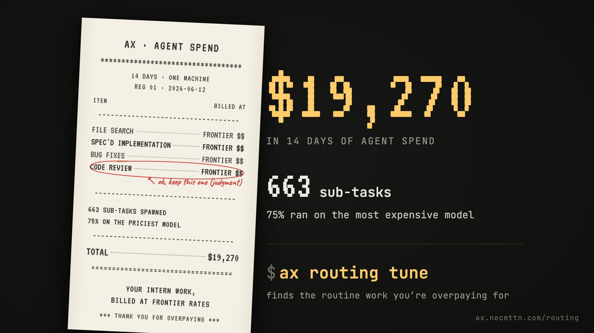
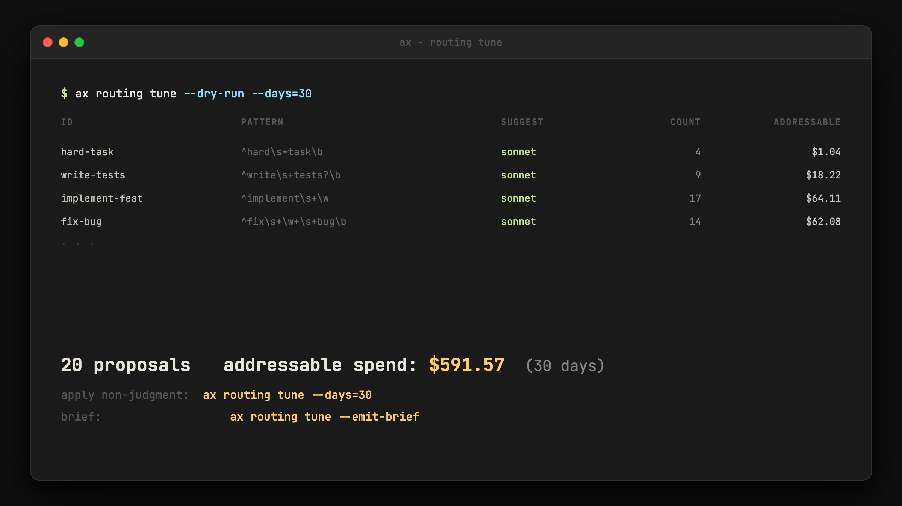
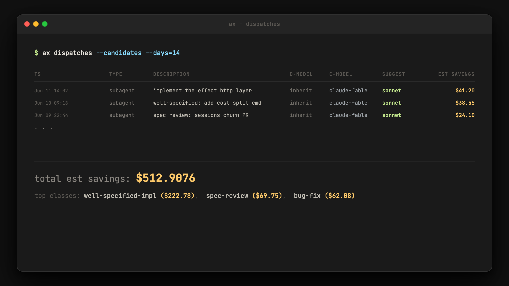

# ax routing tune - launch copy (2026-06-12)

## v2 - post-feedback

Rewritten after user testing. Key changes: the misconception ("Claude Code
already downshifts for sub-tasks") leads; all jargon killed in the thread
(no "pin a model", no "dispatch", no "mines", no "routing classes");
burn-rate/usage-limit framing for the Max audience. v1 is in git history.

Numbers measured on the author's machine, 14-day window ending 2026-06-12
(30d for the tune mining figure). Refresh before publishing if stale.

## X/Twitter thread (7 posts)

**Post 1** [IMAGE: 16:9 receipt visual]

You'd think Claude Code sends the grunt work it spawns to cheaper models. It doesn't. Every sub-task runs on your most expensive model unless something tells it otherwise.

My last 14 days: $19,270. 663 sub-tasks. 75% on the priciest model for no reason.

**Post 2**

That's why your weekly usage limit dies in a couple of hours instead of lasting the week.

On my machine: $2,301 of sub-task spend on fable/opus vs $83 on sonnet. 28:1.

Most of it was routine. File searches. Spec'd implementations. Bug fixes.

**Post 3**

The fix: ax lets your harness switch models automatically.

The smart model keeps the thinking - planning, judgment, review. The routine implementation work it spawns goes to cheaper models.

You don't change how you work. The bill changes.

**Post 4** [SCREENSHOT: ax routing tune --dry-run output]

Shipped today: ax routing tune.

It reads your own usage history and finds the routine work that keeps getting billed at top rates. No AI guessing - just deterministic pattern-matching.

First run on my data: 20 patterns, $591.57 of addressable spend over 30 days.

**Post 5** [SCREENSHOT: ax dispatches --candidates output]

Then the receipts: every sub-task that ran on the expensive model gets repriced against what the cheaper one would have cost, from the actual tokens it burned.

On my machine right now: $512.91 flagged.

**Post 6**

Work that needs judgment never moves. Code review, design, planning, audits - always on the smart model.

Only the routine work gets cheaper. Quality doesn't drop; the meter just stops running on file searches.

**Post 7** [LINK CARD: ax.necmttn.com/routing]

Everything runs on your machine. Your transcripts never leave it.

curl -fsSL https://ax.necmttn.com/install | bash
then: ax routing tune

Full breakdown: ax.necmttn.com/routing

## Standalone tweet

My last 14 days of Claude Code: $19,270. 75% of the 663 sub-tasks it spawned ran on the most expensive model - file searches billed at opus rates.

It doesn't downshift on its own. ax does it for you: smart model thinks, cheaper models grind. Local-only.

github.com/Necmttn/ax

## LinkedIn post

Most people assume Claude Code automatically uses cheaper models for the routine work it spawns - the file searches, the spec'd bug fixes. It doesn't. Every sub-task inherits your default model, which is usually the most expensive one. That's why a weekly usage limit that should last the week is gone in a couple of hours.

I measured it on my own machine: $19,270 of agent spend in 14 days. 663 sub-tasks, 75% on the top-tier model. $2,301 of that routine work billed at frontier rates vs $83 on sonnet - 28:1, for work that mostly didn't need the smart model.

Today I shipped the fix in ax, my local telemetry tool for coding agents. ax lets your harness switch models automatically: the smart model keeps the thinking - planning, review, design - and the routine implementation work goes to cheaper models. `ax routing tune` reads your own usage history and finds the kinds of routine work being overbilled. First run: 20 patterns, $591.57 of addressable spend over 30 days. Then it reprices every overbilled sub-task against the actual tokens it burned: $512.91 flagged on my machine.

One hard rule: judgment work never auto-downgrades. Quality stays where it was. Only the grunt work gets cheaper.

Everything runs locally. Your transcripts never leave your machine. github.com/Necmttn/ax

## 16:9 image - right panel lines

Plain-language overlay text, in order:

1. $19,270 in 14 days of agent spend
2. 663 sub-tasks - 75% ran on the most expensive model
3. `$ ax routing tune` - finds the routine work you're overpaying for

## Production notes

- Post 1 carries the receipt visual; posts 4 and 5 carry the cropped CLI
  screenshots; post 7 carries the ax.necmttn.com/routing link card.
- Crop both screenshots to the footer lines (totals + top patterns) so dollar
  figures read at mobile width.
- Post 6 is the objection-killer ("won't quality drop") - keep it late in the
  thread but never cut it.
- "addressable spend" for the tune figure, "flagged" for candidates - never
  "realized savings" (retrospective repricing, per PR #312 semantics).
- Thread vocabulary is locked plain: "sub-tasks", "routine work", "switch
  models automatically". The /routing page may keep precise terms (dispatch,
  routing classes); the thread may not.
- GIF (optional, replaces post 7 link card only if the card renders badly):
  VHS tape of candidates -> tune -> applied diff -> savings footer.

## v3 - trend angle (June 22 window)

Context (verified 2026-06-12): X is full of Max-plan users posting dead 5-hour
windows and evaporated weekly allowances on Fable. Anthropic's promo ends
June 22 - after that, Fable leaves the flat plan and bills as usage credits
on top ($10/M input, $50/M output - double Opus). These variants ride that
wave. Same locked vocabulary as v2. All numbers are the same measured set
(75%, 663, $19,270, 28:1, $591.57); June 22 / per-token pricing are public
Anthropic facts - state plainly, no speculation past them.

### Trend post 1 (replaces v2 post 1 when riding the trend)

Rest of thread unchanged. Post 2's opener ("That's why your weekly usage
limit dies...") slightly overlaps hook A - acceptable as expansion since
post 2 carries the 28:1 numbers.

**Hook A - direct address (PICK)**

> If you're sitting out a 5-hour window right now: your limit didn't die
> because you coded too much. It died because every sub-task Claude Code
> spawned ran on Fable. My last 14 days: 663 sub-tasks, 75% on the priciest
> model. It never downshifts on its own.

(~254 chars)

**Hook B - the unmeasured why**

> Everyone's posting screenshots of dead 5-hour windows. Nobody's measuring
> why. Claude Code spawns sub-tasks and runs every one on Fable by default.
> My last 14 days: 663 sub-tasks, 75% on the most expensive model. File
> searches, billed at frontier rates.

(~250 chars)

**Hook C - follow the money**

> While you wait for your window to reset: Claude Code ran 75% of my 663
> sub-tasks on Fable for no reason. $19,270 in 14 days, most of it file
> searches and routine bug fixes. The harness never downshifts on its own.
> That's where your allowance went.

(~248 chars)

Why A: it talks to the person mid-cooldown at the exact moment they're
scrolling, and reframes the cause in one move. B is the safest QT-bait;
C leads with the bill for the publish-your-own-numbers crowd.

### June 22 urgency post (standalone, or slot as thread post 1.5)

> 10 days left. Until June 22, Fable lives inside your plan limits - the
> damage is a dead window. After that it bills on top of your plan: $10/M
> in, $50/M out, double Opus. Every sub-task still defaulting to Fable
> becomes a line item. ax routing tune before the meter starts.

(~273 chars)

### Quote-tweet template (for viral "my limit is gone again" posts)

> Same boat - my 14-day bill was $19,270. 75% of the 663 sub-tasks Claude
> Code spawned ran on the most expensive model by default. It never
> downshifts. ax routing tune fixes the default.

(~184 chars)

### Reply-guy second line (optional follow-up to the QT)

> curl -fsSL https://ax.necmttn.com/install | bash && ax routing tune
> Reads your own usage history, local-only. Shows the routine work you're
> overpaying for.

### v3 production notes

- The urgency post stands alone fine; if used inside the thread, slot it
  between posts 1 and 2 and keep post 2 unchanged.
- QT first line is always empathy + own bill. Never open with the product.
  Drop the second line only if the original poster engages or the QT
  travels.
- After June 22, retire the urgency post and swap hook A's framing from
  "limit died" to "line items" - the cooldown complaint becomes a billing
  complaint.
- June 22 / 2x Opus / $10-$50 per M are public Anthropic pricing facts.
  Do not extrapolate beyond them (no projected bills, no "this will cost
  you $X/month" math on other people's usage).
